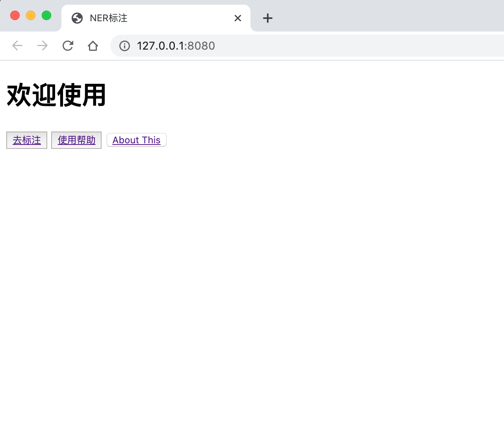
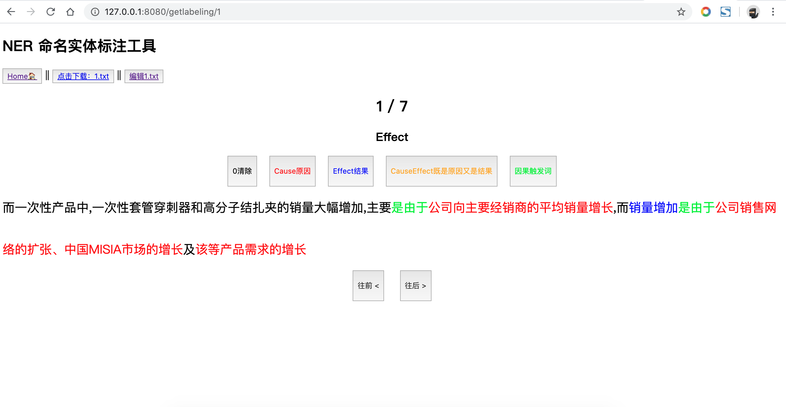

# [CoolNERTool](https://github.com/425776024/CoolNERTool)

#### 开源不易，全网唯一，轻快好用，一键运行，**欢迎star**

Chrome浏览器端端NER实体标注工具，基于Vue + python的fastAPI
- 1.可多人协作共同标注（内网）
- 2.支持模型预标注：读取/写入文件完全一致
- 3.```static/write ```下的是NER数据文件（给出案例），可自己修改
- 4.可以拿模型预测的BIO数据作为输入
- 5.可在线编辑标注文字
- 6.```可以对NER数据做简单的数据增强```（配置config.json中的true/false，会以3.中的NER数据文件目录为基础数据）


## 配置 config
编辑 `/config.json`内含有详细案例，和描述

## 运行 run
```shell
pip install requirements.txt
```
```shell
python run.py （可以修改里面的ip为主机ip，这样内网可共同访问）
```
## 主界面


## 标注界面
- 1.选择上排按钮，点击选择标签
- 2.对中排文字，选择NER实体，点击【选择头一个字和尾一个字】，实体会对应高亮
- 3.无需手动保存，时时自动同步到 配置的输出目录下



## 使用说明
运行后查看首页的[使用帮助]链接
