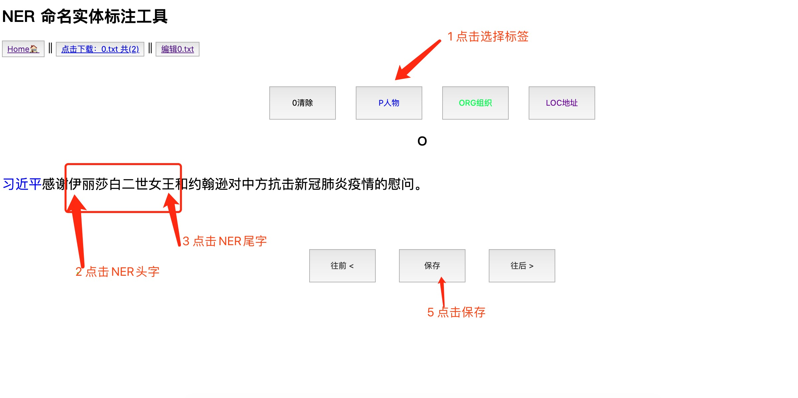

# [CoolNERTool](https://github.com/425776024/CoolNERTool)

自行设计的实体标注工具，基于Vue + python的fastAPI

A NER Labeling Tool , base on Vue + python's fastAPI

- ```static/write ```下的是NER数据文件，可自己修改
- 支持模型预标注：读取/写入文件完全一致
- 可以拿模型预测的BIO数据作为输入

## 使用截图
- 1.选择上排按钮，点击选择
- 2.对中排文字，选择NER实体，点击【选择头一个字和尾一个字】，实体会对应高亮


## 运行 run
```shell
pip install requirements.txt
```
```shell
python run.py
```

## 配置 config
`编辑 info_config.json`

## 使用说明
运行后查看首页的[使用帮助]链接